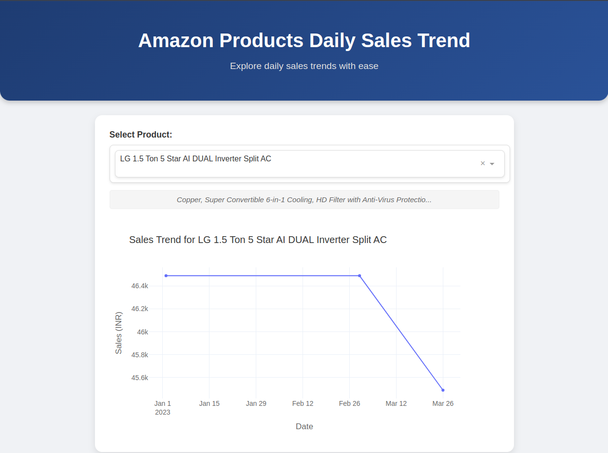

# Amazon Sales Trend Dashboard

  
*Screenshot of the Amazon Sales Trend Dashboard showing product selection and sales trend visualization.*

A web-based dashboard to visualize daily sales trends of Amazon products, built with Dash-Plotly and enhanced with Celery and Redis for efficient processing and caching.

## Table of Contents
- [Overview](#overview)
- [Features](#features)
- [Tech Stack](#tech-stack)
- [Setup](#setup)
- [Usage](#usage)
- [Testing](#testing)
- [Contributing](#contributing)
- [License](#license)

## Overview
This project delivers an interactive dashboard for tracking daily sales trends of Amazon products. Utilizing Dash, a Python framework for web applications, it integrates Celery for asynchronous task handling and Redis for caching to ensure scalability and performance.

## Features
- Interactive dropdown to filter products
- Real-time sales trend visualization with Plotly graphs
- Background data processing via Celery
- Redis caching for faster data retrieval
- Modular design for maintainability
- Dockerized deployment for consistency

## Tech Stack
| Component       | Description                          |
|------------------|--------------------------------------|
| **Dash-Plotly** | Frontend framework for dashboards    |
| **Celery**      | Asynchronous task queue              |
| **Redis**       | In-memory caching solution           |
| **Docker**      | Containerization platform            |
| **Python**      | Primary programming language         |
| **pytest**      | Testing framework                    |

## Setup
Follow these steps to get the project running:

1. **Clone the Repository**  
   ```bash
   git clone https://github.com/mahdikhoshdel/amazon-sales-trend-dashboard.git
   cd amazon-sales-trend-dashboard
   ```

2. **Install Prerequisites**  
   Ensure [Docker](https://www.docker.com/) and Docker Compose are installed on your system.

3. **Build and Start Containers**  
   ```bash
   docker-compose up --build
   ```

4. **Access the Dashboard**  
   Open your browser and navigate to `http://localhost:8050`.

## Usage
- Select a product from the dropdown to view its daily sales trend.
- The graph updates dynamically based on your selection.

## Testing
The project includes unit and integration tests to validate the data processing and caching logic. Use `pytest` to run these tests:

### Manual for Testing with pytest
1. **Access the Web Container**  
   Identify the container name (e.g., `project_web_1`) with:
   ```bash
   docker ps
   ```
   Then enter the container's shell:
   ```bash
   docker exec -it project_web_1 /bin/sh
   ```

2. **Navigate to the Test Directory**  
   Change to the `/app` directory:
   ```sh
   cd /app
   ```

3. **Run the Tests**  
   Execute the following command to run all tests with verbose output:
   ```sh
   pytest -v
   ```
   - **Notes**: 
     - Tests are located in the `tests/` directory (e.g., `tests/test_processor.py`).
     - The `-v` flag provides detailed test results.
     - Ensure the `PYTHONPATH` is set correctly via `pytest.ini` (if configured) or manually with `PYTHONPATH=/app/app` if needed.

4. **Interpret Results**  
   - Success output example:
     ```
     ========================== test session starts ==========================
     platform linux -- Python 3.9.22, pytest-8.3.5, pluggy-1.5.0
     collected 3 items

     tests/test_processor.py ...                                          [100%]

     =========================== 3 passed in 0.12s ===========================
     ```
   - If errors occur (e.g., `ModuleNotFoundError`), verify the directory structure and `pytest.ini` settings.

## Contributing
Contributions are welcome! Please:
- Fork the repository.
- Submit a pull request with your enhancements.
- Suggested improvements:
  - Add advanced visualizations.
  - Optimize data processing.
  - Expand test coverage.

## License
This project is licensed under the [MIT License](LICENSE).
